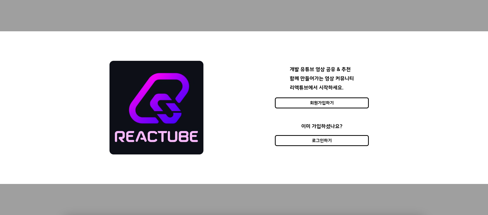
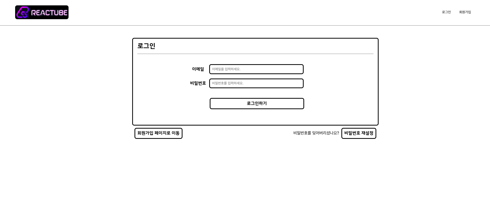
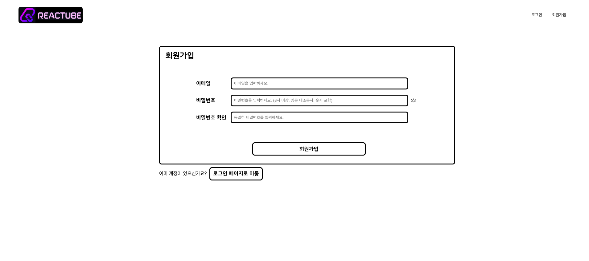
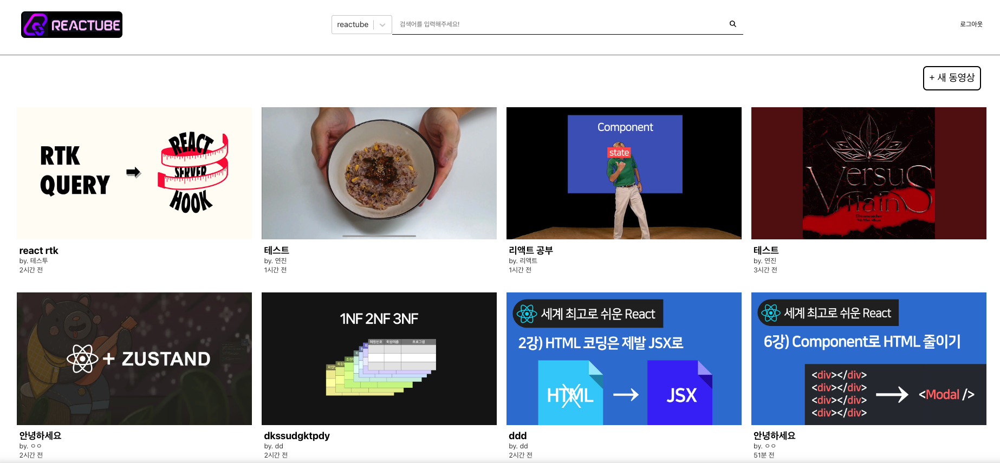

# React 심화 아웃소싱 프로젝트 "ReacTube"

## 🖥️ 프로젝트 소개

## 🎬 구현 사이트 이미지

- 배포 링크 : https://reactube-bay.vercel.app/

- 메인 페이지 이미지 : 
- 로그인 페이지 : 
- 회원 가입 페이지 : 
- 홈 페이지 : 

## 🕰️ 개발 기간

- 2024.02.23 (금) - 2024.02.28 (수)

## ❗ 요구 사항

- Youtube API 사용하기

## 📌 구현 기능

- 회원가입, 로그인 (supabase auth)
- 로그인 인증 완료 후 홈페이지로 이동
- 홈페이지
- 1. 글 작성, 다른 유저들의 글 확인, 검색 기능, 글 클릭 시 상세페이지로 이동
- 2. Youtube 검색 API를 이용하여 검색어에 따른 결과 출력
- 상세페이지
- 1. Youtube iframe을 이용하여 영상 재생 기능
- 2. 댓글 작성 기능 : 가입한 아이디 or 닉네임 입력하여 설정
- supabase : 작성한 글, 댓글, 유저에 대한 정보 저장

## 🔗 컴포넌트 구조

- 컴포넌트 구조 / 레이아웃, 페이지, redux, routes 구조
- , 

## ⚙️ 개발 환경 / 기술스택

- **`npm`**
- **`create-react-app`**
- React
- JavaScript
- HTML
- CSS
- RTK
- React-Query
- vercel
- supabase
